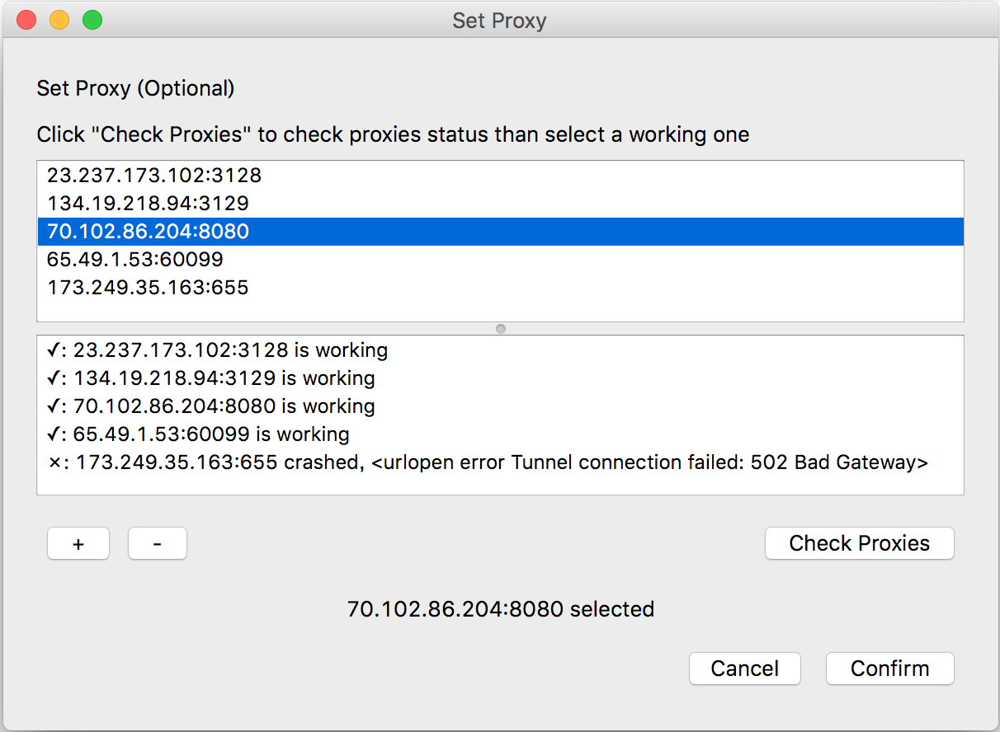
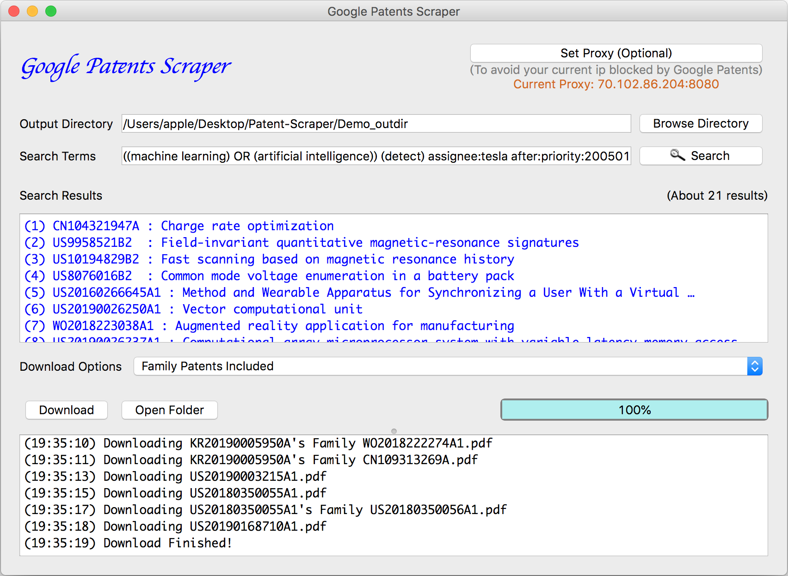

  
  <h2 align="center">Google Patents Scraper</h2>
    

      (1) Automatically download all PDF files of searching results & their patent families.
  

    

    (2) Generate an overview report of searching results.
  

<h2 id="tableofcontents">Table of contents</h2>

<ul>
<li><a href="#applicationdemo">Application Demo</a></li>

<li><a href="#introduction">Introduction</a></li>

<li><a href="#builtwith">Built With</a></li>

<li><a href="#gettingstarted">Getting Started</a></li>

<li><a href="#acknowledgments">Acknowledgments</a></li>
</ul>

<h2 id="applicationdemo">Application Demo</h2>

<h3 id="googlepatentsscraperdemoyoutubehttpsyoutubehrl3chpxbio"><a href="https://youtu.be/HRl3ChPxbIo">Google Patents Scraper – Demo (YouTube)</a></h3>

<iframe width="640" height="360" src="https://www.youtube.com/embed/HRl3ChPxbIo">
</iframe>

<h2 id="introduction">Introduction</h2>

This application scrape Google Patents by two steps:

<ul>
<li>Set Proxy (Optional)</li>

<li>Search &amp; Download Patents</li>
</ul>

<h3 id="setproxyoptional">Set Proxy (Optional)</h3>

<ul>
<li>Set proxy to avoid current ip blocked by Google Patents</li>
</ul>

    

<h3 id="searchdownloadpatents">Search &amp; Download Patents</h3>

<ul>
<li>Select an output directory to store downloaded/generated files</li>

<li>Search whatever you like (search terms' format same as Google Patents)</li>

<li>Download PDF files of searching results &amp; their patent families</li>
</ul>

PDF files and auto-generated <code>overview.md</code> will then be stored in selected directory

    

<h3 id="filestructureofoutputdirectory">File Structure of Output Directory</h3>

<pre>
├── PDFs
│   ├── CN104321947A.pdf
│   ├── ...
│   └── readme.txt
├── Family_PDFs
│   ├── CN104321947A's\ Family
│   │   ├── EP2850716B1.pdf
│   │   ├── ...
│   │   └── readme.txt
│   ├── ...
│   └── ...
└── overview.md
</pre>

<ul>
<li>Output directory of demo located at <a href="https://github.com/wenyalintw/Google-Patents-Scraper/tree/master/Demo_outdir">Demo_outdir</a></li>

<li><a href="https://github.com/wenyalintw/Google-Patents-Scraper/blob/master/Demo_outdir/overview.md">overview.md</a> represents the summary of completed searching</li>
</ul>

<h2 id="builtwith">Built With</h2>

Modules besides python built-ins

<ul>
<li>Web Scarping - <a href="https://www.seleniumhq.org/">Selenium</a> / <a href="https://www.crummy.com/software/BeautifulSoup/">Beautiful Soup</a> / <a href="https://2.python-requests.org//en/master/">requests</a></li>

<li>GUI framework - <a href="https://pypi.org/project/PyQt5/">PyQt5</a></li>

<li>Others - <a href="https://github.com/hellysmile/fake-useragent">fake-useragent</a> / <a href="https://pypi.org/project/tqdm/">tqdm</a></li>
</ul>

<h2 id="gettingstarted">Getting Started</h2>

<h3 id="prerequisites">Prerequisites</h3>

<ul>
<li>Download a <a href="https://chromedriver.chromium.org/">ChromeDriver</a> which correspond with your Chrome version</li>

<li>Replace the one in <a href="https://github.com/wenyalintw/Google-Patents-Scraper/tree/master/src/resources">src/resources</a></li>
</ul>

<h3 id="installation">Installation</h3>

<ul>
<li>Clone the repo</li>
</ul>

<pre><code class="sh language-sh">git clone https://github.com/wenyalintw/Google-Patents-Scraper.git
</code></pre>

<ul>
<li>Install required modules listed in <a href="https://github.com/wenyalintw/Google-Patents-Scraper/blob/master/requirements.txt">requirements.txt</a></li>
</ul>

<pre><code class="sh language-sh">pip install -r /path/to/requirements.txt
</code></pre>

<ul>
<li>Ready to go</li>
</ul>

<pre><code class="sh language-sh">cd src
python main.py
</code></pre>

<h2 id="acknowledgments">Acknowledgments</h2>

<ul>
<li>Checking process of proxies modified from <a href="https://github.com/ApsOps/proxy-checker">ApsOps's repo</a></li>

<li><a href="https://github.com/wenyalintw/Google-Patents-Scraper/blob/master/src/resources/iconfinder_search_461380.png">search.png</a> licensed under "CC BY 3.0" downloaded from <a href="https://www.iconfinder.com/icons/1609653/brain_organs_icon">ICONFINDER</a></li>
</ul>