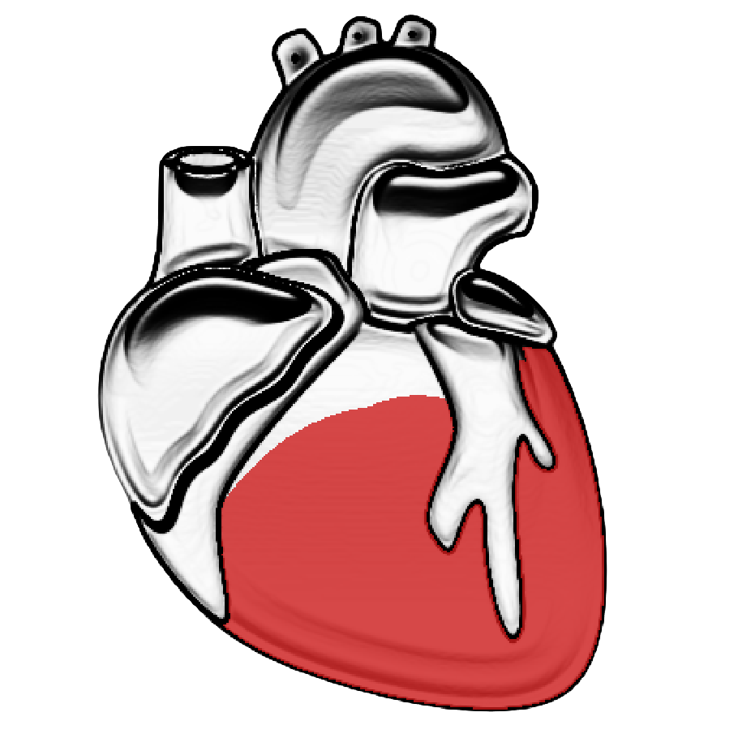
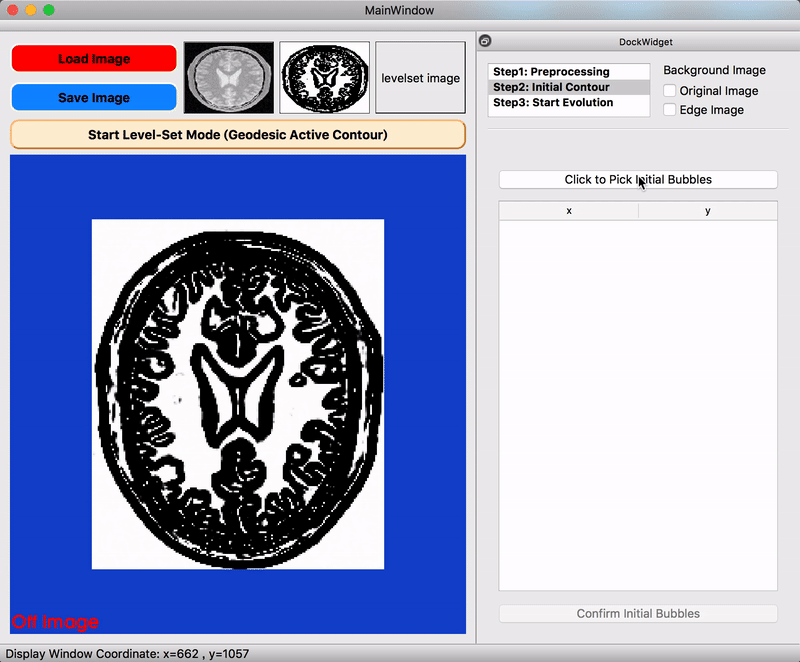

  
  <h2 align="center">Level-Set Visualizer</h2>
  

    Visualize image segmentation based on level set method.
  

<h2 id="tableofcontents">Table of contents</h2>

<ul>
<li><a href="#applicationdemo">Application Demo</a></li>

<li><a href="#introduction">Introduction</a></li>

<li><a href="#builtwith">Built With</a></li>

<li><a href="#installation">Installation</a></li>

<li><a href="#acknowledgments">Acknowledgments</a></li>
</ul>

<h2 id="applicationdemo">Application Demo</h2>

<h3 id="levelsetvisualizerdemoyoutubehttpswwwyoutubecomwatchvutrr98jsrps"><a href="https://www.youtube.com/watch?v=uTrr98JsRps">Level-Set Visualizer – Demo (YouTube)</a></h3>

<iframe width="720" height="480" src="https://www.youtube.com/embed/uTrr98JsRps">
</iframe>

<h2 id="introduction">Introduction</h2>

This application Perform image segmentation by following steps:

<ul>
<li>Load Image &amp; Start Level-Set Mode</li>

<li>Preprocessing</li>

<li>Initial Contour</li>

<li>Start Evolution</li>
</ul>

<h3 id="preprocessing">Preprocessing</h3>

<ul>
<li>Edge detection by <a href="https://itk.org/Doxygen/html/classitk_1_1CurvatureAnisotropicDiffusionImageFilter.html">Anisotropic Diffusion</a>, <a href="https://itk.org/Doxygen/html/classitk_1_1GradientMagnitudeRecursiveGaussianImageFilter.html">Gaussian Gradient</a>, <a href="https://itk.org/Doxygen/html/classitk_1_1SigmoidImageFilter.html">Sigmoid Scaling</a></li>

<li>Control over some edge detection parameters</li>
</ul>

    

<h3 id="initialcontour">Initial Contour</h3>

<ul>
<li>Done by <a href="https://itk.org/Doxygen/html/classitk_1_1FastMarchingImageFilter.html">Fast Marching</a>, support multiple bubbles</li>
</ul>

    

<h3 id="startevolution">Start Evolution</h3>

<ul>
<li>Support media-like control (play/pause/step/rewind) &amp; anchor iteration</li>

<li>Control over 3 parameters based on <a href="https://itk.org/Doxygen/html/classitk_1_1GeodesicActiveContourLevelSetImageFilter.html">Geodesic Active Contour (GAC)</a></li>
</ul>

    

<h2 id="builtwith">Built With</h2>

<ul>
<li><a href="https://itk.org/ITK/resources/legacy_releases.html">ITK 4.12</a> - Image Processing Algorithms</li>

<li><a href="https://vtk.org/download/">VTK 8.2</a> - Image Display</li>

<li><a href="https://doc.qt.io/archives/qt-5.6/index.html">Qt 5.6</a> - GUI framework</li>
</ul>

<h2 id="installation">Installation</h2>

<pre><code class="sh language-sh">$ mkdir build
$ cd build
$ cmake ../src
$ make -j4
</code></pre>

<h2 id="acknowledgments">Acknowledgments</h2>

<ul>
<li>This application is inspired by <a href="http://www.itksnap.org/pmwiki/pmwiki.php">ITK-SNAP</a>.</li>

<li>Processing pipeline &amp; <a href="https://github.com/wenyalintw/Level-Set-Visualizer/tree/master/src/test.png">test.png</a> modified from <a href="https://itk.org/ITKExamples/src/Segmentation/LevelSets/SegmentWithGeodesicActiveContourLevelSet/Documentation.html">ITK GAC Example</a></li>

<li><a href="https://github.com/wenyalintw/Level-Set-Visualizer/tree/master/resources/heart.png">heart.png</a> modified from <a href="https://www.iconfinder.com/icons/44697/cardiology_heart_organ_icon">ICONFINDER</a></li>
</ul>