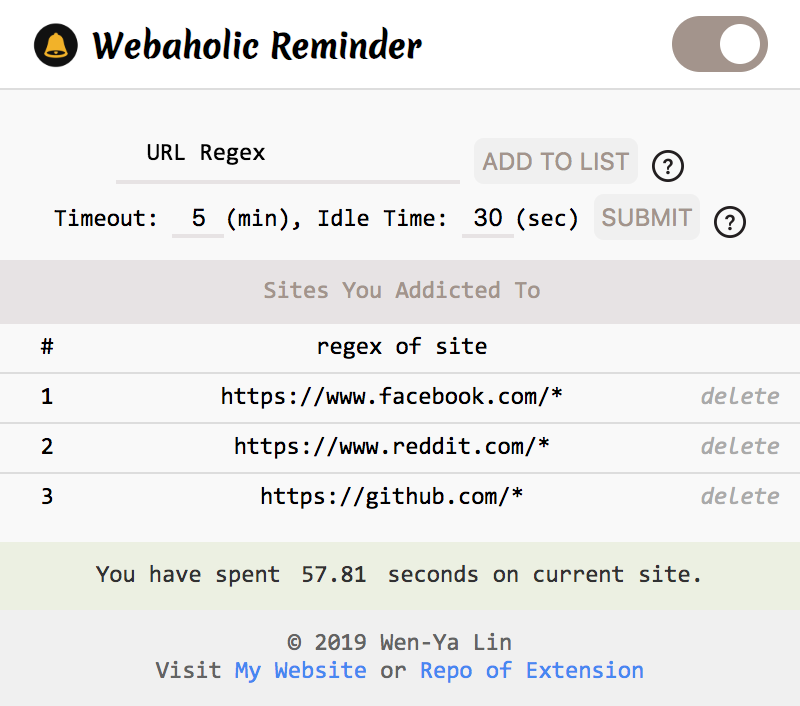
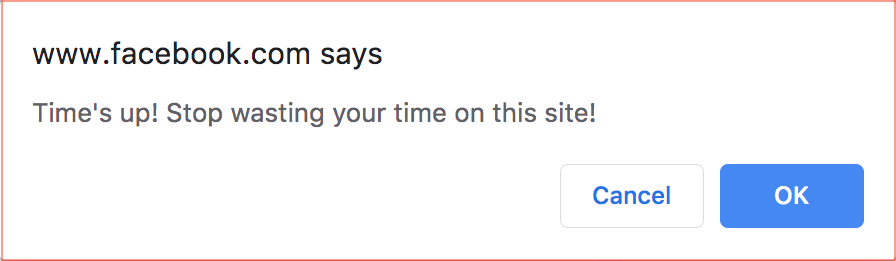
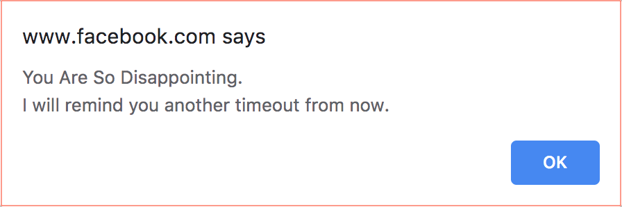
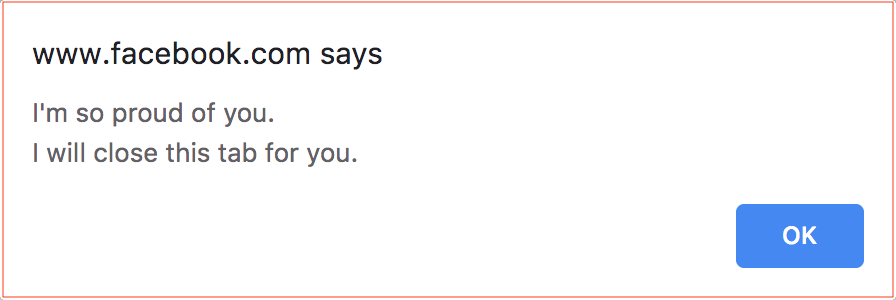

  
  <h2 align="center">Webaholic Reminder</h2>
  <h6 align="center">––––– Chrome Extension –––––</h2>
    

        Remind you to work when you spend too much time on the internet.
    

    

        Currently available on <a href="https://chrome.google.com/webstore/detail/webaholic-reminder/ilidphpahmdlgjlcejdjhbeodnjhdhbb">Chrome Web Store</a>.
    

<h2 id="tableofcontents">Table of contents</h2>

<ul>
<li><a href="#applicationdemo">Application Demo</a></li>

<li><a href="#introduction">Introduction</a></li>

<li><a href="#gettingstarted">Getting Started</a></li>

<li><a href="#acknowledgments">Acknowledgments</a></li>
</ul>

<h2 id="applicationdemo">Application Demo</h2>

<h3 id="webaholicreminderdemoyoutubehttpsyoutubevvirdpcoey0"><a href="https://youtu.be/vVIrdPcOeY0">Webaholic Reminder – Demo (YouTube)</a></h3>

<iframe width="640" height="360" src="https://www.youtube.com/embed/vVIrdPcOeY0">
</iframe>

<h2 id="introduction">Introduction</h2>

Are you a <a href="https://www.urbandictionary.com/define.php?term=webaholic">Webaholic</a>?  
If the answer is yes, this extension will help you quit "web-addiction" by two steps:

<ul>
<li>Set Sites &amp; Timeout</li>

<li>Annoying Reminding</li>
</ul>

<h3 id="setsitestimeout">Set Sites &amp; Timeout</h3>

<ul>
<li>Set sites you are addicted to in <a href="https://developer.mozilla.org/en-US/docs/Web/JavaScript/Guide/Regular_Expressions">regex expression</a> (ex:  <code>youtube.com</code>, <code>reddit</code>, <code>https://facebook.com/*</code>)</li>

<li>Set timeout and idle time</li>

<li>Extension will count the time you spend on site if current url match the regex you set</li>

<li>Timer will pause if you go idle after "Idle Time"</li>
</ul>

    

<strong>＊＊＊ Important ＊＊＊</strong>

<ul>
<li>All settings (including ON-OFF switch) will only apply to new page (including reload)</li>

<li>Existed page comply with old settings</li>

<li>Disambiguation - If browser "load" a page after setting, it is a new page</li>
</ul>

<h3 id="annoyingreminding">Annoying Reminding</h3>

<ul>
<li>Extension will remind you on "Timeout"</li>

<li>You've got to choose stop wasting time or not</li>
</ul>

    

<ul>
<li>If you click "Cancel", extension will remind you after another timeout</li>
</ul>

    

<ul>
<li>If you click "OK", extension will close the tab for you</li>
</ul>

    

<h2 id="gettingstarted">Getting Started</h2>

<h3 id="foruser">For User</h3>

<ul>
<li>Just click <a href="https://chrome.google.com/webstore/detail/webaholic-reminder/ilidphpahmdlgjlcejdjhbeodnjhdhbb">HERE</a> to install it</li>
</ul>

<h3 id="fordeveloper">For Developer</h3>

<ul>
<li>Clone the repo</li>
</ul>

<pre><code class="sh language-sh">git clone https://github.com/wenyalintw/Webaholic-Reminder.git
</code></pre>

<ul>
<li>Go to <code>chrome://extensions/</code> and click <code>Load unpacked</code> to load <code>/src</code></li>

<li>Play around with the code ⇄ reload</li>
</ul>

<h2 id="acknowledgments">Acknowledgments</h2>

<ul>
<li>Timing function borrow and modified from <a href="https://github.com/jasonzissman/TimeMe.js/">jasonzissman's repo: TimeMe.js</a></li>

<li>Reference of apperance design - <a href="https://chrome.google.com/webstore/detail/adblock-plus-free-ad-bloc/cfhdojbkjhnklbpkdaibdccddilifddb">Adblock Plus</a> / <a href="https://chrome.google.com/webstore/detail/google-translate/aapbdbdomjkkjkaonfhkkikfgjllcleb">Google Translate</a> / <a href="https://freefrontend.com/css-input-text/">FREE FRONTEND</a> / <a href="https://www.fabriziovanmarciano.com/button-styles/">FVM</a> / <a href="https://codepen.io/leoespsanto/pen/pEftw">CodePen</a></li>
</ul>

<h6 id="mitlicense2019wenyalin">MIT License (2019), Wen-Ya Lin</h6>